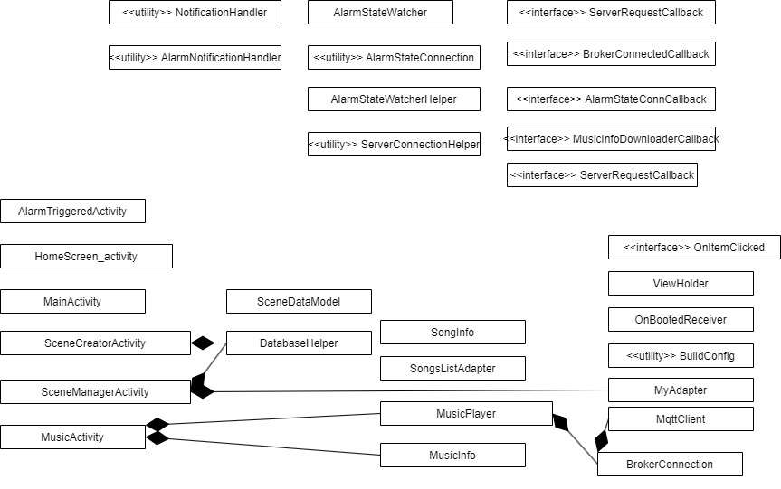
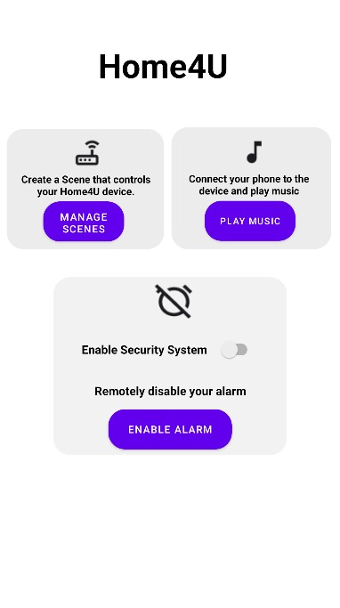
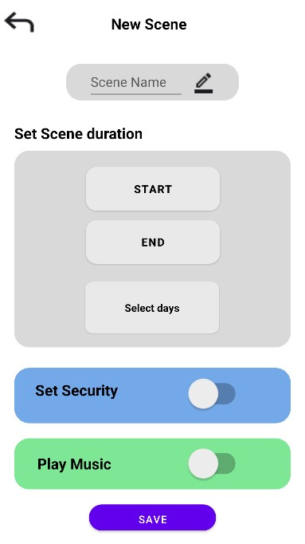
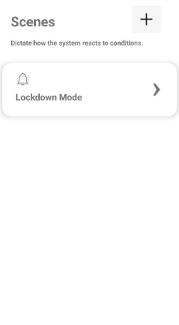
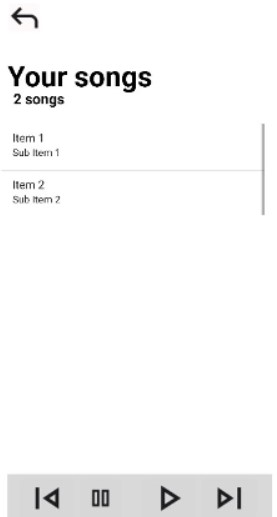
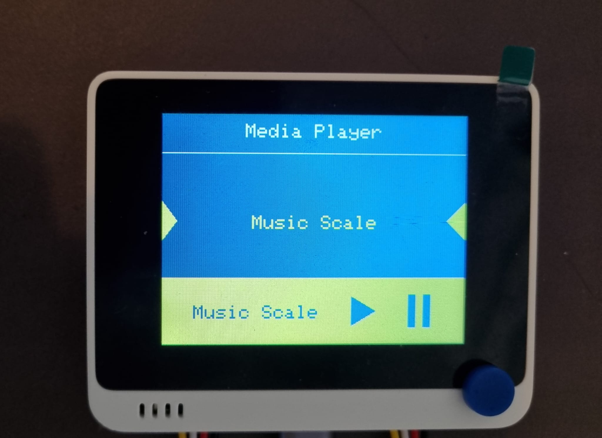
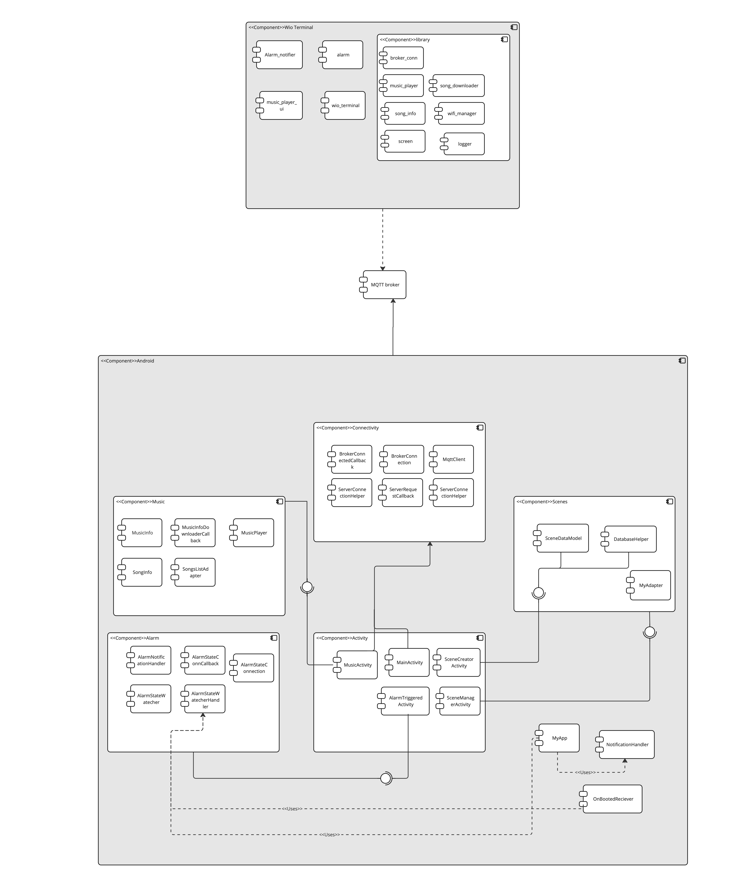

# Home4U - Group 16
## Description
HOME4U is a smart home system that provides users with the experience of monitoring home security from a distance and enjoying smart control of their home through devices. This involves:
- Set security mode from Wio terminal and app
- Turn off alarm through app and Wio terminal
- Interact (play, pause, skip) songs via app and Wio terminal 
- Create scenes (though unable to execute, open to development)

## Team Information
Group Number: 16 
| Name           | Email                   |
|----------------|-------------------------|
| Henrik Lagrosen | guslagrhe@student.gu.se |
| Shiyao Xin     | gusshiyxi@student.gu.se |
| Jitish Padhya  | guspadji@student.gu.se  | 
| Jacob Sundelid | gussundeja@student.gu.se |
| Raghav Tengse  | gustengra@student.gu.se |
| Utkarsh Singh  | gussinut@student.gu.se  |

Further information about the group is [here](https://git.chalmers.se/courses/dit113/2023/group-16/group-16/-/wikis/team-contract).

## Setup and Get Started
### Material
Hardware requirement:
- Wio terminal
- Grove - Speaker
- Grove - Mini PIR Motion Sensor
- Android phone
- Laptop or computer

### Setup
*Speaker (left), mini PIR motion sensor (right) connected to Wio terminal*

The following image above shows the setup for the Wio terminal to your computer using an USB-C port. Make sure the speaker is connected to the left side and motion sensor to the right side unless code has been altered.

### Automated Build
**For the android application:**
```
cd android && ./gradlew build
```
**For Wio Terminal:**
```
docker build -t wio_terminal_image ./wio_terminal
```
*This will build the app inside a Docker image. To extract the built file, also run:*
```
docker run --name wio_terminal_container wio_terminal_image
docker cp wio_terminal_container:wio_terminal/build/wio_terminal.ino.bin .
docker stop wio_terminal_container
docker rm wio_terminal_container
```

## Hardware and Software Architecture
[//]: <> (Add image for software and hardware architecture)


## Contributions
| Name           | Contributions|
|----------------|-------------------------|
| Henrik Lagrosen| Implementing music streaming (#18, #20). Backend for playing the streamed music (#4), a tool to generate music, and part of the music player UI. Controlling music using a phone (#8, #9, #36, #10). Downloading and displaying music for Wio Terminal and Android (#19, #4, #18). Notify of alarm and acknowledge through Android (#13, #35). GitLab CI/CD pipeline (#23, #28).|
| Shiyao Xin     | Implement backend for security system, incl. enabling and disabling security mode, turning off the alarm triggered by detected motion both via Wio Terminal and Android app, and enabling alarm manually via Android app (#2, #15, #38); create media player UI for Wio Terminal(#4); implement backend for scenes and scene manager UI(#7); work on executing scenes(#26 marked as out-of-scope); clean up code(#29); merge code for Android(#34); adjust Android App layout(#30); make milestone plannings. |
| Jitish Padhya  |Create scenes page, implement front-end, and back-end for new scene creator along with SQLite database [#7](https://git.chalmers.se/courses/dit113/2023/group-16/group-16/-/issues/7), worked on executing scenes [#26 (out-of-scope)](https://git.chalmers.se/courses/dit113/2023/group-16/group-16/-/issues/26), and final README file[#37](https://git.chalmers.se/courses/dit113/2023/group-16/group-16/-/issues/37) | 
| Jacob Sundelid | N/A |
| Raghav Tengse  |Designing screens for android app, implement front end and back end for music screen[#22](https://git.chalmers.se/courses/dit113/2023/group-16/group-16/-/issues/22), input button message from android application.[#8](https://git.chalmers.se/courses/dit113/2023/group-16/group-16/-/issues/8)  Created the deliverables page for Sprint-1 and Sprint-2. Created Video Demos for the sprints.|
| Utkarsh Singh  |Create home screen for android application [#21](https://git.chalmers.se/courses/dit113/2023/group-16/group-16/-/issues/21), implement pause feature for wio terminal[#5](https://git.chalmers.se/courses/dit113/2023/group-16/group-16/-/issues/5), implement pause feature for android application.[#9](https://git.chalmers.se/courses/dit113/2023/group-16/group-16/-/issues/9), final ReadMe file[#37](https://git.chalmers.se/courses/dit113/2023/group-16/group-16/-/issues/37).  |

## Visuals
<details>
<summary>App visuals</summary>

|            |              |
|----------------|-------------------------|
|*Home screen* |*Create scenes*  |
| *Manage scenes*| *Song player* |
</details>

<details>
<summary>Wio terminal visuals</summary>

*Wio terminal home screen*


The wio terminal has more screens that provide information such as alarm is actived or diactived, and it being triggered.
 
</details>

[//]: <> (TODO)

## Full documentation
See [Wiki](https://git.chalmers.se/courses/dit113/2023/group-16/group-16/-/wikis/home) for further information regarding project information, usage, team contract and the 3 sprint deliveries.

## Project status and Support
The project is stopped completely after 21/05/2023 hence there are unfinished requirements and its associated features that weren't able to be accomplished in the given time frame. Though, an MVP is available for everyone!

Look for contact information under [team information](#team-members) for any support.
