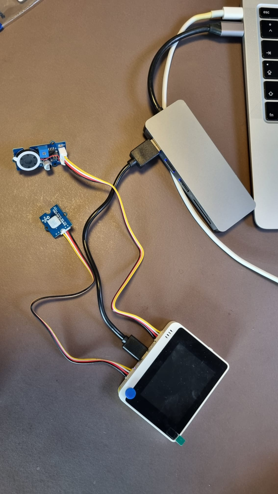

# Home4U - Group 16
## Description
HOME4U is a smart home system that provides users with the experience of monitoring home security from a distance and enjoying smart control of their home through devices. This involves:
- Set security mode from Wio terminal and app
- Turn off alarm through app and Wio terminal
- Interact (play, pause, skip) songs via app and Wio terminal 
- Create scenes (though unable to execute, open to development)

## Team Information
Group Number: 16 
| Name           | Email                   |
|----------------|-------------------------|
| Henrik Lagrosen | guslagrhe@student.gu.se |
| Shiyao Xin     | gusshiyxi@student.gu.se |
| Jitish Padhya  | guspadji@student.gu.se  | 
| Jacob Sundelid | gussundeja@student.gu.se |
| Raghav Tengse  | gustengra@student.gu.se |
| Utkarsh Singh  | gussinut@student.gu.se  |

Further information about the group is [here](https://git.chalmers.se/courses/dit113/2023/group-16/group-16/-/wikis/team-contract).

## Setup and Get Started
### Material
Hardware requirement:
- Wio terminal
- Grove - Speaker
- Grove - Mini PIR Motion Sensor
- Android phone
- Laptop or computer

### Setup
*Speaker (left), mini PIR motion sensor (right) connected to Wio terminal*

The following image above shows the setup for the Wio terminal to your computer using an USB-C port. Make sure the speaker is connected to the left side and motion sensor to the right side unless code has been altered.

### Automated Build
For the android application:
```
cd android && ./gradlew build
```
For Wio terminal:
```
docker build -t wio_terminal_image ./wio_terminal
```

## Hardware and Software Architecture
[//]: <> (Add image for software and hardware architecture)

## Visuals

[//]: <> (TODO)

Depending on what you are making, it can be a good idea to include screenshots or even a video (you'll frequently see GIFs rather than actual videos). Tools like ttygif can help, but check out Asciinema for a more sophisticated method.

## Usage

[//]: <> (TODO)

Use examples liberally, and show the expected output if you can. It's helpful to have inline the smallest example of usage that you can demonstrate, while providing links to more sophisticated examples if they are too long to reasonably include in the README.

## Contributions
| Name           | Contributions|
|----------------|-------------------------|
| Henrik Lagrosen|  |
| Shiyao Xin     |  |
| Jitish Padhya  |Create scenes page, implement front-end, and back-end for new scene creator along with SQLite database [#7](https://git.chalmers.se/courses/dit113/2023/group-16/group-16/-/issues/7), worked on executing scenes [#26 (out-of-scope)](https://git.chalmers.se/courses/dit113/2023/group-16/group-16/-/issues/26), and final README file | 
| Jacob Sundelid |  |
| Raghav Tengse  |Designing screens for android app, implement front end and back end for music screen[#22](https://git.chalmers.se/courses/dit113/2023/group-16/group-16/-/issues/22), input button message from android application.[#8](https://git.chalmers.se/courses/dit113/2023/group-16/group-16/-/issues/8)  |
| Utkarsh Singh  |Create home screen [#21](https://git.chalmers.se/courses/dit113/2023/group-16/group-16/-/issues/21), implement pause feature for wio terminal[#5](https://git.chalmers.se/courses/dit113/2023/group-16/group-16/-/issues/5), implement pause feature for android application.[#9](https://git.chalmers.se/courses/dit113/2023/group-16/group-16/-/issues/9)  |

## Full documentation
See [Wiki](https://git.chalmers.se/courses/dit113/2023/group-16/group-16/-/wikis/home) for further information regarding project information, usage, team contract and the 3 sprint deliveries.

## Project status and Support
The project is stopped completely after 21/05/2023 hence there are unfinished requirements and its associated features that weren't able to be accomplished in the given time frame. Though, an MVP is available for everyone!

Look for contact information under [team information](#team-members) for any support.